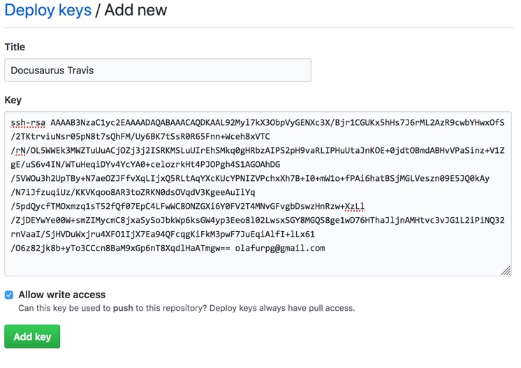

It's possible to use mdoc with [Docusaurus](https://docusaurus.io/) to build
documentation websites. Several projects already use mdoc in combination with
Docusaurus:

- [Scalafmt](https://scalameta.org/scalafmt/)
- [Scalafix](https://scalacenter.github.io/scalafix/)
- [Scalameta](http://scalameta.org/)
- [Metals](https://scalameta.org/metals/)
- [Bloop](https://scalacenter.github.io/bloop/)
- [Coursier](https://coursier.github.io/coursier/)
- [Almond](http://almond-sh.github.io/almond/stable/docs/intro)
- [fs2-kafka](https://ovotech.github.io/fs2-kafka/)

## Requirements

- [`yarn`](https://yarnpkg.com/en/): to run docusaurus.

## Installation

First, install the sbt-mdoc plugin using the normal
[mdoc installation instructions](installation.md#sbt).

Next, enable the `mdoc.DocusaurusPlugin` in addition to the `mdoc.MdocPlugin`
and define the `moduleName` setting to have your project name suffixed with
`-docs`.

```diff
 // build.sbt
 lazy val docs = project
   .settings(
+    moduleName := "myproject-docs",
   )
-  .enablePlugins(MdocPlugin)
+  .enablePlugins(MdocPlugin, DocusaurusPlugin)
   .dependsOn(myproject)
```

Next, setup a normal Docusaurus site following the
[Docusaurus installation instructions](https://docusaurus.io/).

Once you have a Docusaurus site setup, update `siteConfig.js` to point
`customDocsPath` to the `mdocOut` directory with the generated mdoc output.

```diff
+ customDocsPath: "myproject-docs/target/mdoc",
```

## Create static site

Generate a static website with `docs/docusaurusCreateSite`. This task runs
several steps:

- `sbt docs/mdoc`
- `cd website && yarn install && yarn run build`
- creates `website/build/index.html` that redirects to `/myproject/`
- relativizes all links in the generated html so that it can be hosted on
  http://static.javadoc.io/

The static website gets generated in the `website/build` directory. You can copy
these files over to any static HTTP server to host your website. A simple
`sbt docs/clean` will delete the previous folder since the `DocusaurusPlugin`
will also bind it to the standard SBT `clean` task.

## Publish to GitHub pages locally

If you have a GitHub repository with a gh-pages branch, update `siteConfig.js`
to include the following information:

```diff
+  projectName: "mdoc",
+  organizationName: "scalameta",
```

Next, run `docs/docusaurusPublishGhpages` to publish the website to GitHub
pages. This task run several steps:

- `sbt docs/mdoc`
- `cd website && yarn install && USE_SSH=true yarn publish-gh-pages`

## Publish to GitHub pages from CI

You can configure your Travis CI server to publish docs after merge into master.
The [Docusaurus docs](https://docusaurus.io/docs/en/publishing#using-travis-cih)
already have excellent instructions for how to set this up. If those
instructions work for you, then that's great! No need to read this section here.
However, you prefer to use "deploy keys" over "personal access tokens because
deploy keys are limited to individual repositories instead of per-account. If
this sounds interesting, read ahead.

### Deploy key

Open the "Deploy key" menu in your project settings:
https://github.com/scalameta/mdoc/settings/keys. Press "Add deploy key".

- `Title`: use "Docusaurus Travis".
- `Allow write access`: check the box, this is requires since we want to write
  to the `gh-pages` branch from CI.
- `Key`: generate a fresh SSH key using `ssh-keygen`

  ```sh
  mkdir ~/.github
  cd ~/.github
  ssh-keygen -t rsa -b 4096 -C "olafurpg@gmail.com"
  Enter file in which to save the key (/Users/ollie/.ssh/id_rsa): myproject
  Enter passphrase (empty for no passphrase): <ENTER, NO PASSPHRASE>
  Enter same passphrase again: <ENTER, NO PASSPHRASE>
  Your identification has been saved in myproject.
  Your public key has been saved in myproject.pub.
  ```

  It's important to use an **empty passphrase** so that the CI can install the
  key. Next, copy the public key and paste it into the GitHub "Key" field.

  ```sh
  # macOS
  cat myproject.pub | pbcopy
  # Linux
  cat myproject.pub | xclip
  ```

Your screen should look like this



### Environment variables

Next open the Travis CI settings panel for your project:
https://travis-ci.org/scalameta/mdoc/settings.

Add the following values:

- `GITHUB_DEPLOY_KEY` or `GIT_DEPLOY_KEY`: the base64 encoded secret key. Note,
  the secret key is the file without the `.pub` extension
  ```sh
  # macOS
  cat myproject | base64 | pbcopy
  # Ubuntu (assuming GNU base64)
  cat myproject | base64 -w0 | xclip
  # FreeBSD (assuming BSD base64)
  cat myproject | base64 | xclip
  ```

### `.travis.yml`

Next, update .travis.yml to trigger `docs/docusaurusPublishGhpages` on
successful merge into master and on tag push. There are many ways to do this,
but I recommend using Travis
["build stages"](https://docs.travis-ci.com/user/build-stages/). It's not
necessary to use build stages but they make it easy to avoid publishing the
website multiple times from parallel jobs. Define the `test` and `release` build
stages

```yml
stages:
  - name: test
  - name: release
    if: (branch = master AND type = push) OR (tag IS present)
```

Next, define your build matrix with `docs/docusaurusPublishGhpages` at the end

```yml
jobs:
  include:
    # stage="test" if no stage is specified
    - env: TEST="test"
      script: sbt test
    # release runs only if the previous stages passed
    - stage: release
      script: sbt docs/docusaurusPublishGhpages
```

For a complete example of the Travis configuration, see the
[.travis.yml](https://github.com/scalameta/mdoc/blob/master/.travis.yml) in this
project.

You're all set! Merge a PR to your project and watch the Travis job release the
docs 😎

## Include Scaladoc in site

You can configure a project to include Scaladocs in its site. Below is an
example configuration that uses [sbt-unidoc](https://github.com/sbt/sbt-unidoc)
to aggregate Scaladocs across multiple projects.

```diff
 // build.sbt
 lazy val docs = project
   .settings(
     moduleName := "myproject-docs",
+      unidocProjectFilter in (ScalaUnidoc, unidoc) := inProjects(myproject1, myproject2),
+      target in (ScalaUnidoc, unidoc) := (baseDirectory in LocalRootProject).value / "website" / "static" / "api",
+      cleanFiles += (target in (ScalaUnidoc, unidoc)).value,
+      docusaurusCreateSite := docusaurusCreateSite.dependsOn(unidoc in Compile).value,
+      docusaurusPublishGhpages := docusaurusPublishGhpages.dependsOn(unidoc in Compile).value,
   )
-  .enablePlugins(MdocPlugin, DocusaurusPlugin)
+  .enablePlugins(MdocPlugin, DocusaurusPlugin, ScalaUnidocPlugin)
   .dependsOn(myproject1, myproject2)
```

Make sure that you've added the
[sbt-unidoc](https://github.com/sbt/sbt-unidoc#how-to-add-this-plugin)
dependency to `project/plugins.sbt`.

Now the `docs/docusaurusCreateSite` command will generate Scaladocs in the
`website/static/api` directory, which you'll probably want to add to your
`.gitignore`:

```diff
  // .gitignore
  website/translated_docs
  website/build/
  website/yarn.lock
  website/node_modules
  website/i18n/*
  !website/i18n/en.json
+ website/static/api
```

You'll need to tweak your `siteConfig.js` file to make Docusaurus play nicely
with Scaladoc's CSS. You may want to add a header link to your API docs too:

```diff
  // website/siteConfig.js
+ const baseUrl = '/my-project/' // Base URL for your project */

  const siteConfig = {
    ...
-   baseUrl: /my-project/,
+   baseUrl: baseUrl,
    ...
    headerLinks: [
+    { href: `${baseUrl}api/index.html`, label: 'API'},
    ],
    // by default Docusaurus combines CSS files in a way that doesn't play nicely with Scaladoc
+   separateCss: ["api"],
    ...
  }
```
