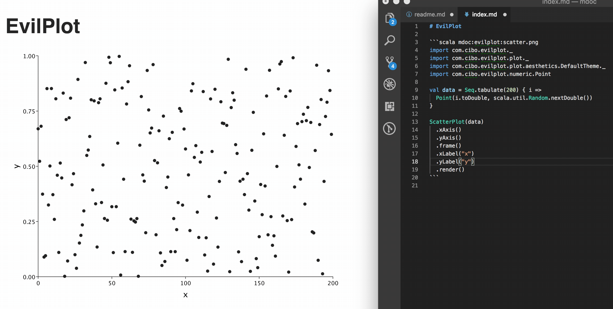
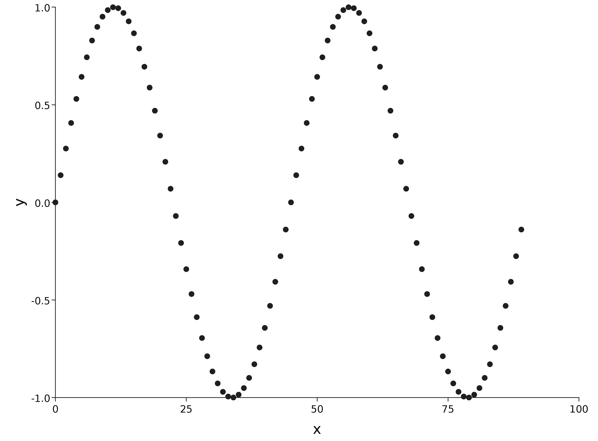

Code fences with the `scala mdoc` modifier are compiled and evaluated on the JVM
at markdown generation time.

## Default

The default modifier compiles and executes the code fence as normal

````scala mdoc:mdoc
```scala mdoc
val x = 1
val y = 2
x + y
```
````

## Silent

The `silent` modifier is identical to the default modifier except that it hides
the evaluated output. The input code fence renders unchanged.

````scala mdoc:mdoc
```scala mdoc:silent
val x = 1
val y = 2
x + y
```
```scala mdoc
x + y
```
````

## Fail

The `fail` modifier asserts that the code block will not compile. The rendered
output contains the type error message.

````scala mdoc:mdoc
```scala mdoc:fail
val x: Int = ""
```
````

A `fail` code fence with no compile error fails the build.

````scala mdoc:mdoc:crash
```scala mdoc:fail
val x: String = ""
```
````

> Note that `fail` does not assert that the program compiles but crashes at
> runtime. To assert runtime exceptions, use the `crash` modifier.

## Crash

The `crash` modifier asserts that the code block throws an exception at runtime

````scala mdoc:mdoc
```scala mdoc:crash
val y = ???
```
````

## Passthrough

The `passthrough` modifier collects the stdout and stderr output from the
program and embeds it verbatim in the markdown file.

````scala mdoc:mdoc
```scala mdoc:passthrough
val matrix = Array.tabulate(4, 4) { (a, b) =>
  val multiplied = (a + 1) * (b + 1)
  f"$multiplied%2s"
}
val table = matrix.map(_.mkString("| ", " | ", " |")).mkString("\n")
println(s"""
This will be rendered as markdown.

* Bullet 1
* Bullet 2

Look at the table:

$table
""")
```
````

## Invisible

The `invisible` modifier evaluates the code but does not render anything. The
`invisible` modifier is equivalent to `passthrough` when the expression does not
print to stdout.

````scala mdoc:mdoc
This is prose.
```scala mdoc:invisible
println("I am invisible")
```
More prose.
````

## Reset

The `reset` modifier starts a new scope where previous statements in the
document are no longer available. This can be helpful to clear existing imports
or implicits in scope.

````scala mdoc:mdoc
```scala mdoc
implicit val x: Int = 41
```

```scala mdoc:reset
implicit val y: Int = 42
implicitly[Int] // x is no longer in scope
```
```scala mdoc:fail
println(x)
```
````

## PostModifier

A `PostModifier` is a custom modifier that post-processes a compiled and
interpreted mdoc code fence. Post modifiers have access to the original code
fence text, the static types and runtime values of the evaluated Scala code, the
input and output file paths and other contextual information.

One example use-case for post modifiers is to render charts based on the runtime
value of the last expression in the code fence.



Extend the `mdoc.PostModifier` trait to implement a post modifier.

```scala mdoc:file:mdoc-docs/src/main/scala/mdoc/docs/EvilplotModifier.scala

```

Next, create a resource file `META-INF/services/mdoc.PostModifier` so the post
modififer is recognized by the JVM
[ServiceLoader](https://docs.oracle.com/javase/7/docs/api/java/util/ServiceLoader.html)
framework.

```scala mdoc:file:mdoc-docs/src/main/resources/META-INF/services/mdoc.PostModifier

```

As long as `EvilplotModifier` is available on the classpath, for example via
`libraryDependencies` in build.sbt, then you can use the modifier like this.

````scala mdoc:mdoc
```scala mdoc:evilplot:assets/scatterplot.png
import com.cibo.evilplot._
import com.cibo.evilplot.plot._
import com.cibo.evilplot.plot.aesthetics.DefaultTheme._
import com.cibo.evilplot.numeric.Point

val data = Seq.tabulate(90) { i =>
  val degree = i * 8
  val radian = math.toRadians(degree)
  Point(i.toDouble, math.sin(radian))
}

ScatterPlot(data)
  .xAxis()
  .yAxis()
  .frame()
  .xLabel("x")
  .yLabel("y")
  .render()
```
````

Which renders into a scatter plot like this:



It's important that post modifiers present helpful error messages to the user in
case of failures. For example, if the last runtime value is not an EvilPlot
`Drawable` we can report the expected and obtained types with carets pointing to
the position of the last variable.

````scala mdoc:mdoc:crash
```scala mdoc:evilplot:scatterplot.png
val message = "hello world!"
```
````

## StringModifier

A `StringModifier` is a custom modifier that processes the plain text contents
of a code block, ignoring the compilation and interpretation of the Scala code.

```scala mdoc:silent
import mdoc.StringModifier
import mdoc.Reporter
import scala.meta.Input
class FooModifier extends StringModifier {
  override val name = "foo"
  override def process(info: String, code: Input, reporter: Reporter): String = {
    val originalCodeFenceText = code.text
    val isCrash = info == "crash"
    if (isCrash) "BOOM"
    else "OK: " + originalCodeFenceText
  }
}
```

Next, create a resource file `META-INF/services/mdoc.StringModifier` so the post
modififer is recognized by the JVM
[ServiceLoader](https://docs.oracle.com/javase/7/docs/api/java/util/ServiceLoader.html)
framework.

```scala mdoc:file:mdoc-docs/src/main/resources/META-INF/services/mdoc.StringModifier

```

Code blocks with the `mdoc:foo` modifier will render as follows.

````scala mdoc:mdoc
```scala mdoc:foo
Hello world!
```
````

We can also add the argument `:crash` to render "BOOM".

````scala mdoc:mdoc
```scala mdoc:foo:crash
Hello world!
```
````

## Scastie

The `scastie` modifier transforms a Scala code block into a
[Scastie](https://scastie.scala-lang.org/) snippet.

> ℹ️ This modifier will work only in environments that support embedding a
> `<script>` tag. For example, it won't work in GitHub readmes, but it will work
> when building a static website from Markdown (e.g., with
> [Docusaurus](https://docusaurus.io/))

You can embed an existing Scastie snippet by its id:

````scala mdoc:mdoc
```scala mdoc:scastie:xbrvky6fTjysG32zK6kzRQ

```
````

or in case of a user's snippet:

````scala mdoc:mdoc
```scala mdoc:scastie:MasseGuillaume/CpO2s8v2Q1qGdO3vROYjfg

```
````

> ⚠️ The empty line in the block can't be omitted due to how the Markdown parser
> works

Moreover, you can quickly translate any Scala code block block into a Scastie
snippet on the fly.

````scala mdoc:mdoc
```scala mdoc:scastie
val x = 1 + 2
println(x)
```
````

> ⚠️ Inline snippets are slower to run than embedded ones, since they won't be
> cached. You should prefer embedding existing snippets whenever possible.

You can choose the Scastie theme when initializing the Scastie modifier:

```scala mdoc
import mdoc.modifiers.ScastieModifier
new ScastieModifier(theme = "dark") // default is "light"
```
